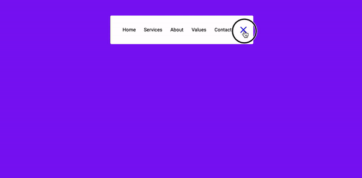

## Dynamic & Responsive Navigation Bar

This project, designed by [Ola Arowolo](https://tech.olaarowolo.com), implements a dynamic and responsive navigation bar. 

The navigation bar adapts its layout and content based on screen size, providing a seamless user experience across all devices.

## Features

- **Dynamic Content**: The navigation bar can be populated with content fetched from various sources, such as databases or APIs.
- **Responsive Design**: The navigation bar automatically adjusts its layout to fit desktops, tablets, and mobile phones.
- **Accessibility**: The navigation bar is built with accessibility in mind, ensuring usability for all users.

## Technologies Used

- HTML
- CSS
- JavaScript (recommended, for the implementation of dynamic content)

## Installation

1. Clone this repository to your local machine:
   git clone [clone] https://github.com/yourusername/dynamic-responsive-navbar.git

## Copyright

This project is licensed under a [Creative Commons Attribution (CC BY)](https://creativecommons.org/licenses/by/4.0/) license.

### Attribution (BY)

You must give appropriate credit, provide a link to the license, and indicate if changes were made.
 You must do so in a reasonable manner, but not in any way that suggests the licensor endorses you or your use.

## How to Use

1. Clone this repository to your local machine.
2. If using JavaScript, install any required dependencies.
3. Refer to the included documentation (if provided) for specific setup instructions.
4. Customize the navigation bar's appearance and content to fit your website's needs.

## Credits

Design by [Ola Arowolo](https://tech.olaarowolo.com)